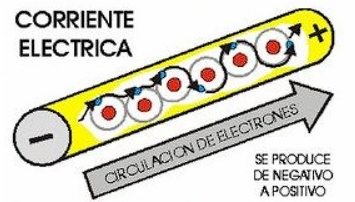

# Conceptos Básicos de Electricidad

## 1. Corriente, Voltaje y Resistencia

### Corriente (I): 
Es el flujo de electrones a través de un conductor, como un cable. Se mide en amperios (A). Puedes pensar en la corriente como el "caudal" de agua que fluye por una tubería.

  

### Voltaje (V): 
Es la diferencia de potencial eléctrico entre dos puntos en un circuito. Se mide en voltios (V). El voltaje es la "presión" que impulsa a los electrones a moverse por el circuito, similar a cómo la presión del agua empuja el flujo a través de una tubería.

### Resistencia (R): 
Es la oposición que un material ofrece al paso de la corriente. Se mide en ohmios (Ω). La resistencia es como la "estrechez" de la tubería que dificulta el paso del agua.
