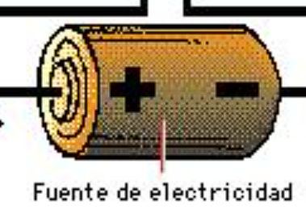

# Conceptos Básicos de Electricidad

## 1. Corriente, Voltaje y Resistencia

### Corriente (I): 
Es el flujo de electrones a través de un conductor, como un cable. Se mide en amperios (A). Puedes pensar en la corriente como el "caudal" de agua que fluye por una tubería.

### Voltaje (V): 
Es la diferencia de potencial eléctrico entre dos puntos en un circuito. Se mide en voltios (V). El voltaje es la "presión" que impulsa a los electrones a moverse por el circuito, similar a cómo la presión del agua empuja el flujo a través de una tubería.

### Resistencia (R): 
Es la oposición que un material ofrece al paso de la corriente. Se mide en ohmios (Ω). La resistencia es como la "estrechez" de la tubería que dificulta el paso del agua.

## Ley de Ohm

La Ley de Ohm describe la relación entre la corriente, el voltaje y la resistencia en un circuito eléctrico. Se expresa con la fórmula:

V = I X R

V (Voltaje) es igual a la I (Corriente) multiplicada por la R (Resistencia).
Si conoces dos de estos valores, puedes calcular el tercero.
Ejemplo: Si tienes una resistencia de 10 ohmios y aplicas un voltaje de 5 voltios, la corriente que fluye por el circuito será:

I = V/R = 5V/10Ω = 0.5A

Esto significa que 0.5 amperios de corriente fluyen por el circuito.

## 2. Circuitos Básicos

Un circuito eléctrico básico consta de los siguientes componentes:

Fuente de Energía: Suministra el voltaje necesario para mover los electrones. Puede ser una batería, una fuente de alimentación, etc.

Resistor: Componente que limita la cantidad de corriente que fluye a través del circuito, protegiendo otros componentes de sobrecargas.

Interruptor: Controla el flujo de corriente en el circuito. Cuando el interruptor está cerrado, el circuito se completa y la corriente puede fluir. Cuando está abierto, se interrumpe el flujo de corriente.

Funcionamiento de un Circuito Simple:

Conexión de la fuente de energía: Conecta un extremo de la batería a un resistor y el otro extremo del resistor a un interruptor.

Conexión del interruptor: Conecta el otro terminal del interruptor al segundo terminal de la batería.

Cuando cierras el interruptor, se completa el circuito y la corriente fluye desde la batería, a través del resistor, y de vuelta a la batería. Esto permite que, por ejemplo, se encienda un LED si está en el circuito.

Importancia:

Los circuitos simples son la base de la electrónica. Entender cómo fluye la corriente en estos circuitos te permitirá diseñar y analizar sistemas más complejos en el futuro.
